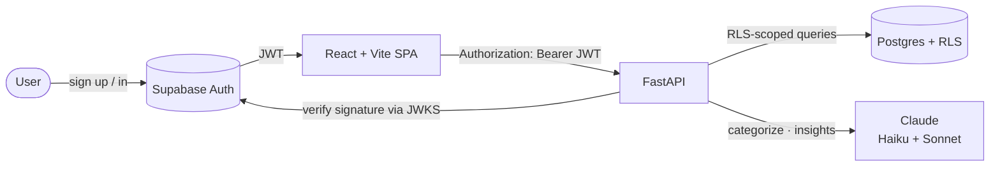

# 💰 AI Finance Insights

> Upload a bank-statement CSV → Claude categorizes every transaction, charts where your money goes, writes a plain-English summary with anomaly flags, and forecasts next month's spend.

A full-stack, multi-user GenAI web app: a **React (Vite + TypeScript)** single-page app talking to a **FastAPI (Python)** backend, with **Supabase (Postgres + Auth)** and per-user **Row-Level Security**, powered by **Anthropic Claude**.


---

## ✨ Features

- **CSV import** — drop in a bank/credit-card export; transactions are parsed and stored per user.
- **AI categorization** — one batched **Claude Haiku** call labels every transaction (Groceries, Dining, Subscriptions, …).
- **Insightful dashboard** — spend-by-category and month-over-month charts (Recharts).
- **AI narrative + flags** — **Claude Sonnet** writes a plain-English monthly summary and flags anomalies and likely subscriptions.
- **Next-month forecast** — a pure-Python, recency-weighted projection of upcoming spend.
- **Secure by design** — Supabase Auth (JWT verified via JWKS) + Postgres **Row-Level Security**, so every row is scoped to its owner at the database layer.

## 📸 Screenshots

> _Add your own captures to `docs/` and they'll render here._

| Dashboard | AI Insights |
|---|---|
| `docs/dashboard.png` | `docs/insights.png` |

---

## 🏗️ Architecture



**Auth flow (defense in depth):** Supabase Auth issues an asymmetric (ES256) JWT → the SPA sends it as a Bearer token → FastAPI verifies the signature per request against Supabase's public JWKS (no shared secret) → Postgres Row-Level Security scopes every query to the authenticated user. A bug in the API still can't leak another user's rows.

**Two-model AI pipeline:** a cheap, fast model (Haiku) does high-volume per-transaction labeling; a stronger model (Sonnet) does the lower-volume reasoning (the monthly narrative and flags). Right tool, right cost.

## 🧰 Tech stack

| Layer | Tech |
|---|---|
| Frontend | React 18, Vite, TypeScript (strict), Recharts |
| Backend | FastAPI, Python 3.12, Pandas, PyJWT (JWKS/ES256) |
| Data + Auth | Supabase — Postgres + Auth, Row-Level Security |
| AI | Anthropic Claude — Haiku (categorize) + Sonnet (insights) |

---

## 🚀 Run it locally

### 1. Supabase
1. Create a project at [supabase.com](https://supabase.com).
2. In the **SQL Editor**, run [`supabase/schema.sql`](supabase/schema.sql) (creates the tables + RLS policies — safe to re-run).
3. **Authentication → Sign In / Providers → Email →** turn **off "Confirm email"** for local dev (so sign-up logs you straight in).
4. **Settings → API Keys** → copy the **Project URL**, the **`anon`** key (backend), and the **publishable** key (frontend).

### 2. Backend
```bash
cd backend
python -m venv venv && source venv/bin/activate   # or: uv venv --python 3.12
pip install -r requirements.txt
cp .env.example .env        # fill in SUPABASE_URL + SUPABASE_ANON_KEY + ANTHROPIC_API_KEY
uvicorn app.main:app --reload --port 8000
```
Check → http://localhost:8000/health returns `{"status":"ok"}`. Run the tests with `pytest`.

### 3. Frontend
```bash
cd frontend
npm install
cp .env.example .env        # fill in VITE_SUPABASE_URL + VITE_SUPABASE_ANON_KEY + VITE_API_BASE
npm run dev
```
Open http://localhost:5173 → sign up → import [`sample-transactions-6months.csv`](sample-transactions-6months.csv) → click **Categorize with AI** → watch the charts, insights, and forecast populate.

---

## ☁️ Deploy

The frontend (static SPA) and backend (Python API) deploy separately.

### Backend → Railway (or Render)
- **Railway:** New Project → Deploy from this repo → set the service **Root Directory** to `backend`. Railway picks up [`backend/railway.json`](backend/railway.json) / `Procfile` automatically.
- **Render:** use the included [`render.yaml`](render.yaml) blueprint (Root Directory `backend`).
- Set these env vars on the service:
  | Var | Value |
  |---|---|
  | `SUPABASE_URL` | your project URL |
  | `SUPABASE_ANON_KEY` | the `anon` key |
  | `ANTHROPIC_API_KEY` | your Anthropic key (set a monthly spend cap) |
  | `CORS_ORIGINS` | your Vercel URL, e.g. `https://your-app.vercel.app` |
- Copy the backend's public URL (e.g. `https://…up.railway.app`).

### Frontend → Vercel
- New Project → import this repo → set **Root Directory** to `frontend` (Vercel auto-detects Vite).
- Set env vars: `VITE_SUPABASE_URL`, `VITE_SUPABASE_ANON_KEY` (publishable key), and `VITE_API_BASE` = the backend URL from above.
- Deploy, then add the resulting Vercel URL back into the backend's `CORS_ORIGINS`.

> **Tip:** deploy the backend first so you have its URL for `VITE_API_BASE`, then deploy the frontend and feed its URL back into `CORS_ORIGINS`.

---

## 🔌 API

| Method | Route | Description |
|---|---|---|
| `GET` | `/health` | Liveness probe (public) |
| `GET` | `/me` | Returns the authenticated `user_id` |
| `POST` | `/transactions/import` | Upload a CSV of transactions |
| `GET` | `/transactions` | List the user's transactions |
| `POST` | `/transactions/categorize` | AI-categorize uncategorized rows (Haiku) |
| `GET` | `/insights` | Monthly summary + narrative + flags + forecast (Sonnet) |

All routes except `/health` require a valid Supabase JWT.

## 🗺️ Roadmap

- [x] Auth + per-user RLS
- [x] CSV import
- [x] AI categorization (Haiku)
- [x] Spend-by-category + month-over-month charts
- [x] AI insights (Sonnet) + anomaly/subscription flags
- [x] Next-month forecast
- [ ] Recurring-transaction detection · budget goals · multi-account support
